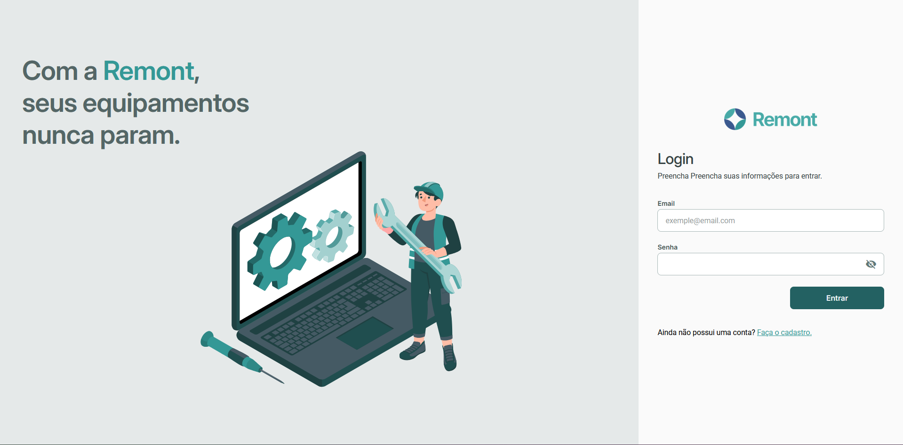
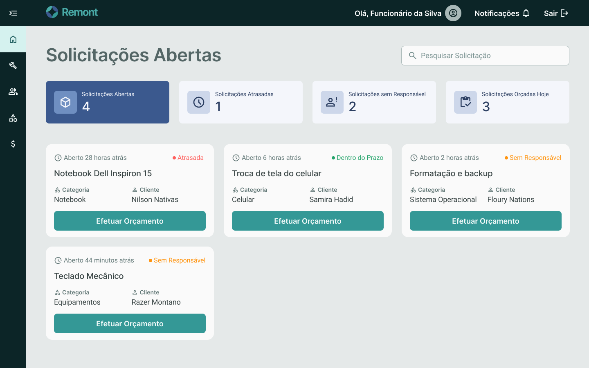
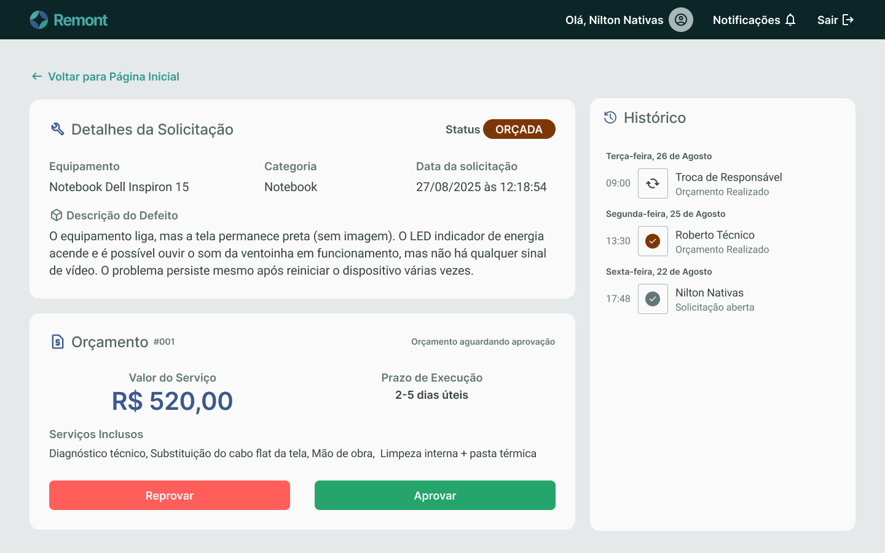

# Sistema de Manutenção - Web 2

Projeto desenvolvido para a disciplina de Desenvolvimento Web 2 do curso de Tecnologia em Análise e Desenvolvimento de Sistemas da Universidade Federal do Paraná (UFPR).
O objetivo é criar um sistema completo para gerenciamento de ordens de serviço de manutenção, utilizando uma arquitetura moderna com frontend desacoplado do backend.

<h1 align="center">
    
</h1>

<h2 align="center"> 
	🚧 Remont Manutenções 🚧
</h2>

<p align="center">
	
</p>

<p align="center">
 <a href="#-sobre-o-projeto">Sobre</a> •
 <a href="#%EF%B8%8F-funcionalidades">Funcionalidades</a> •
 <a href="#-layout">Layout</a> • 
 <a href="#-tecnologias">Tecnologias</a> • 
 <a href="#%EF%B8%8F-como-executar-o-projeto">Como executar</a> • 
 <a href="#%E2%80%8D-contribuidores">Contribuidores</a> 
</p>

## 💻 Sobre o projeto


Projeto desenvolvido durante a disciplina de **Desenvolvimento Web 2** do curso de [Tecnologia em Análise e Desenvolvimento de Sistemas - TADS](https://www.tads.ufpr.br/)  da [Universidade Federal do Paraná (UFPR)](https://ufpr.br/).

---

## ⚙️ Funcionalidades
Documentação completa das funcionalidades do projeto: [Requisitos Manutenção de Equipamentos](https://docs.google.com/document/d/11Ejbn9VTktDQ2bZ6m-AZpqZPwXer45Seo9yxqIuGTPI/edit?tab=t.0#heading=h.498daia6ixli)

- [x] Auto Cadastro:
  - [x] Criptografia de senha SHA256 + SALT
  - [x] Envio de email

- [x] Autenticação:
  - [x] Spring Security
  - [x] JWT

- [x] Dashboard de Clientes:
  - [x] Criação de solicitações
  - [x] Detalhe da solicitação com histórico
  - [x] Aprovar/Rejeitar orçamentos
  - [x] Resgatar solicitações
  - [x] Pagar solicitações

- [x] Dashboard de Funcionário:
  - [x] Visualização de solicitações em Kanban
  - [x] Gestão de solicitações:
    - Criar orçamento
    - Atribuir/Redirecionar funcionários
    - Efetuar manutenção
    - Finalizar solicitações
  - [x] CRUD de funcionários
  - [x] CRUD de categorias de solicitações
  - [x] Emissão de relatórios em PDF

---

## 🎨 Layout

O layout da aplicação está disponível no Figma:

<a href="https://www.figma.com/design/wrJqs3g9LIfTvvC0FdCKxH/Sistema-de-Manuten%C3%A7%C3%A3o-Web-2?node-id=0-1&t=aStInRpGDCwPhZ19-1">
  
</a>

<p align="center" style="display: flex; align-items: flex-start; justify-content: center;">
  

  
</p>

---


## 🛠 Tecnologias

As seguintes ferramentas foram usadas na construção do projeto:

-   **Frontend:** [Angular 19](https://v19.angular.dev/overview)
    - [Angular Material](https://material.angular.dev/)
-   **Backend:** [Spring Boot 3 - Java 21](https://spring.io/projects/spring-boot)
    - Spring Security
    - Spring Data JPA
    - Spring Mail
    - Spring Dev Tools
    - Open PDF
    - Auth0 JWT
-   **Banco de Dados:** [MySQL](https://www.mysql.com/)

## 🛣️ Como executar o projeto

###  Pré-requisitos

Antes de começar, você vai precisar ter instalado em sua máquina:
*   [Docker Desktop](https://www.docker.com/products/docker-desktop/)

###  Rodando o Projeto

Siga os passos abaixo para executar o projeto localmente.

#### 1. Clonar o Repositório
```bash
git clone https://github.com/EduKaique/sistema-manutencao-angular-spring
cd ./sistema-manutencao-angular-spring
```

#### 2. Subir o docker
Suba a Docker Compose da aplicação (frontend, backend e MySQL).
```bash
docker compose up -d
```

#### 3. Entrar com usuários de teste
- Funcionário:
    - email: admin@remont.com, senha: 9876
- Cliente:
    - email: joao@gmail.com, senha: 1234

## 👨‍💻 Contribuidores

Devs que contribuíram neste projeto

<table>
  <tr>
    <td align="center"><a href="https://www.linkedin.com/in/eduardo-kaique-dev/"><br /><sub><b>Eduardo Kaique</b></sub></a><br /><a href="https://www.linkedin.com/in/eduardo-kaique-dev/" title="Linkedin Eduardo Kaique">👨‍💻</a></td>
    <td align="center"><a href="https://www.linkedin.com/in/emanuelle-rodrigues-silverio-34bab7213/"><br /><sub><b>Emanuelle Rodrigues Silverio</b></sub></a><br /><a href="https://www.linkedin.com/in/emanuelle-rodrigues-silverio-34bab7213/" title="Linkedin Emanuelle">👨‍💻</a></td>
    <td align="center"><a href="https://www.linkedin.com/in/gabriel-brasil-ba5b6b235/"><br /><sub><b>Gabriel Brasil</b></sub></a><br /><a href="https://www.linkedin.com/in/gabriel-brasil-ba5b6b235/" title="Linkedin Gabriel Brasil">👨‍💻</a></td>
    <td align="center"><a href="https://www.linkedin.com/in/meduardafcarvalho/"><br /><sub><b>Maria Eduarda</b></sub></a><br /><a href="https://www.linkedin.com/in/meduardafcarvalho/" title="Linkedin Maria Eduarda">👩‍💻</a></td>
    <td align="center"><a href=""><br /><sub><b>Maria Júlia</b></sub></a><br /><a href="" title="">👩‍💻</a></td>
	  <td align="center"><a href="https://www.linkedin.com/in/rafael-pomponio/"><br /><sub><b>Rafa Pomps</b></sub></a><br /><a href="https://www.linkedin.com/in/rafael-pomponio/" title="Linkedin Rafa Pomps">👩‍💻</a></td>
  </tr>
</table>

Desenvolvido para a disciplina de Desenvolvimento Web 2 - UFPR.
